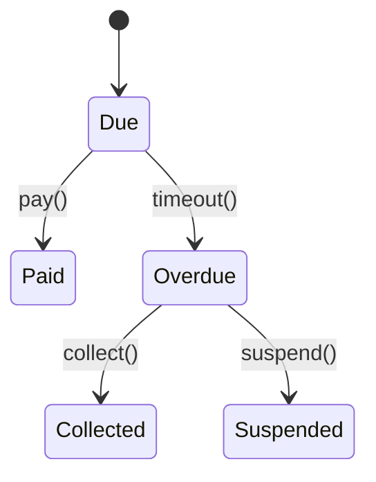

# Billing Module



## API
- `POST /v1/billing/invoices`
- `GET /v1/billing/history/{tenant_id}`

## Example
```php
$response = Http::post('/v1/billing/invoices', [
    'tenant_id' => $tenantId,
    'modules' => [ ['amount' => 50] ],
]);
```
