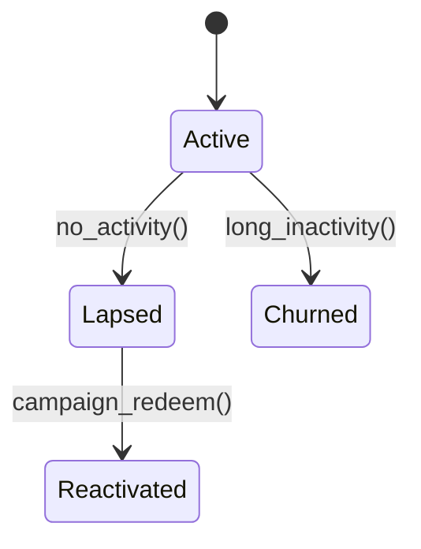

# CRM Module

The CRM module manages customers, segments and marketing campaigns.

## State Machine



## Domain Events

`crm.campaign.sent@v1` is published when a campaign is dispatched.

```php
use Modules\Crm\Events\CampaignSent;
use App\Support\EventBus;

$event = new CampaignSent('303', 'high_value');
app(EventBus::class)->publish($event->toArray()['event'].'@v1', $event->toArray()['data']);
```

## API

- `POST /v1/crm/campaigns` – send a campaign to a segment
- `GET /v1/crm/segments` – list segments

## RFM Example

```php
use Modules\Crm\Services\RfmCalculator;

$score = app(RfmCalculator::class)->calculate(10, 5, 1200); // 5
```
