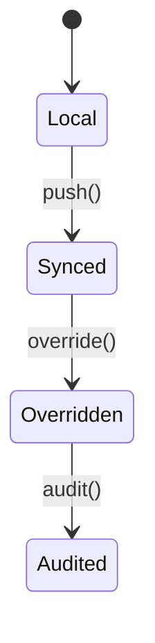

# Franchise Module

Manages franchise templates, overrides and aggregated reporting.

## State Machine



## Usage

```php
// Push template changes
Http::patch('/v1/franchise/templates', [
    'template_id' => $id,
    'changes' => ['price' => 20],
]);
```
