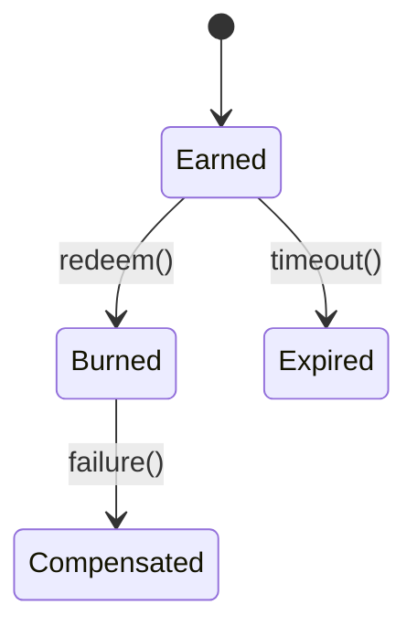

# Loyalty Module

Handles earning, burning and expiry of loyalty points across tenants.

## API
- `POST /v1/loyalty/redeem`
- `GET /v1/loyalty/balance/{customer_id}`

## Events
- Emits `loyalty.points.earned@v1` when points are added.

