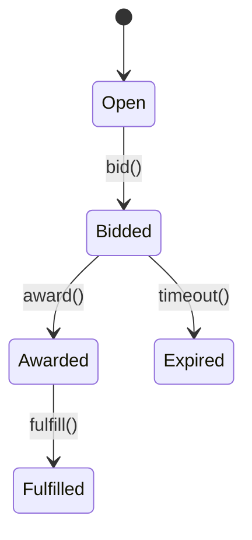

# Marketplace Module

Provides supplier storefronts, listings and bid workflow.

## Bid State

## Events
- Emits `marketplace.bid.awarded@v1`
- Consumes `procurement.rfq.created@v1`

## API
- `POST /v1/marketplace/bids`
- `GET /v1/marketplace/stores/{supplier_id}`
