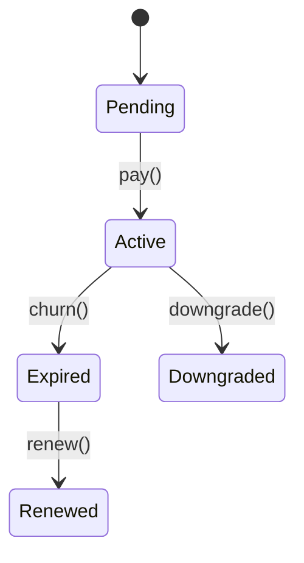

# Membership Module

Manages membership tiers, perks and recurring billing for EliteSaaS.



## API

- `PATCH /v1/membership/{id}` – upgrade a member to a new tier.
- `GET /v1/membership/perks/{tier}` – list perks available for a tier.

## Events

Emits `membership.tier.upgraded@v1` with payload:

```json
{ "member_id": "123", "tier": "gold" }
```

## Example

```php
$membership->upgrade('gold');
```
