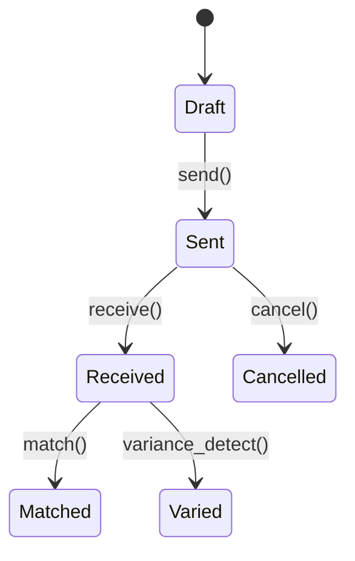

# Procurement Module

Manages RFQs, bids, purchase orders and goods receipt notes.

```mermaid
stateDiagram-v2
    [*] --> Draft
    Draft --> Sent: send()
    Sent --> Received: receive()
    Received --> Matched: match()
    Sent --> Cancelled: cancel()
    Received --> Varied: variance_detect()
```

### Events
- Emits `procurement.po.created@v1`
- Consumes `inventory.low.stock@v1`
